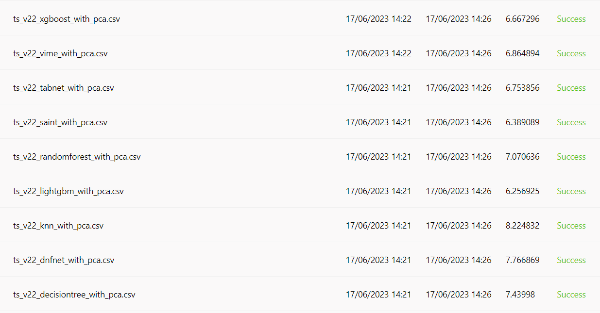

# RecSys2023 Challenge
## How to use
### Prepare a parquet data from all csv files
It's the same as the `src/README.md`

### Train and infer using challenge data
Run `./testall.sh`

## Result
Use this repo to compare many different model's output using the same feature engineering method.
